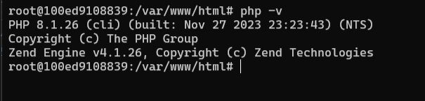

# API UAS Afif

## SETUP

Pertama tama install dulu php dan laravelnya

Disini aku pake PHP 8.1.26




Kalo MySQL nya aku pake versi 8.0.32


Kalo mau pake dibawah itu tidak apa2 yang penting jangan dibawah versi 8

Terus kalo sudah semua jangan lupa install composer 
pake command berikut

```bash
php -r "copy('https://getcomposer.org/installer', 'composer-setup.php');"
php -r "if (hash_file('sha384', 'composer-setup.php') === 'e21205b207c3ff031906575712edab6f13eb0b361f2085f1f1237b7126d785e826a450292b6cfd1d64d92e6563bbde02') { echo 'Installer verified'; } else { echo 'Installer corrupt'; unlink('composer-setup.php'); } echo PHP_EOL;"
php composer-setup.php
php -r "unlink('composer-setup.php');"
```

Terus tambahin composer tadi ke path mu
Kalo udah bisa install git dulu di <a href="https://git-scm.com/download/win" target="_blank">sini</a>

terus kalo sudah bisa clone repo ku ini pake command:

```bash
git clone https://github.com/juniantowicaksono06/afif-uas-api
```

terus bisa install semua packagenya dengan command:
```bash
composer install
```

## Environment

Setting dulu environemntnya cuy dengan buat file .env di project rootnya

terus bisa nambahin file .env yang udah aku buat ini
```env
APP_NAME=Laravel
APP_ENV=local
APP_KEY=base64:sBlrgfEjj/Brr4o1dlvwACgoBhZiPtHX2d4P1j8I60M=
APP_DEBUG=true
APP_URL=http://localhost

LOG_CHANNEL=stack
LOG_DEPRECATIONS_CHANNEL=null
LOG_LEVEL=debug

DB_CONNECTION=mysql
DB_HOST=afif_mysql
DB_PORT=3306
DB_DATABASE=laravel
DB_USERNAME=root
DB_PASSWORD=Abcd1234

BROADCAST_DRIVER=log
CACHE_DRIVER=file
FILESYSTEM_DISK=local
QUEUE_CONNECTION=sync
SESSION_DRIVER=file
SESSION_LIFETIME=120

MEMCACHED_HOST=127.0.0.1

REDIS_HOST=127.0.0.1
REDIS_PASSWORD=null
REDIS_PORT=6379

MAIL_MAILER=smtp
MAIL_HOST=mailpit
MAIL_PORT=1025
MAIL_USERNAME=null
MAIL_PASSWORD=null
MAIL_ENCRYPTION=null
MAIL_FROM_ADDRESS="hello@example.com"
MAIL_FROM_NAME="${APP_NAME}"

AWS_ACCESS_KEY_ID=
AWS_SECRET_ACCESS_KEY=
AWS_DEFAULT_REGION=us-east-1
AWS_BUCKET=
AWS_USE_PATH_STYLE_ENDPOINT=false

PUSHER_APP_ID=
PUSHER_APP_KEY=
PUSHER_APP_SECRET=
PUSHER_HOST=
PUSHER_PORT=443
PUSHER_SCHEME=https
PUSHER_APP_CLUSTER=mt1

VITE_APP_NAME="${APP_NAME}"
VITE_PUSHER_APP_KEY="${PUSHER_APP_KEY}"
VITE_PUSHER_HOST="${PUSHER_HOST}"
VITE_PUSHER_PORT="${PUSHER_PORT}"
VITE_PUSHER_SCHEME="${PUSHER_SCHEME}"
VITE_PUSHER_APP_CLUSTER="${PUSHER_APP_CLUSTER}"

JWT_SECRET=gImxhGuwo8ReSGgv4Kk3qxf01WqzsRd2LJHEkrXNBQclcintO7TQQ4ZDJyzUREmz

JWT_ALGO=HS256
```

## Migration
Untuk buat table nya bisa menggunakan php artisan migrate
pertama buat dulu databasenya lewat SQLYog atau dbeaver
lalu bisa jalankan perintah
```bash
php artisan migrate
```

Lalu cek apakah sudah tercreate tablenya

## API ENDPOINT

Ada dua endpoint utama:
1. /api/supporter
2. /api/klub-sepakbola


API nya bisa dicoba akses lewat postman dulu

### Supporter
#### Create Supporter
```API
POST /supporter
```

##### Parameter Body
###### Pilih Form Data di Postman
```bash
id_supporter=<STRING>
nama=<STRING>
alamat=<STRING>
no_telpon=<NUMBER>
tgl_daftar=<DATE>
foto=<FILE>
```

#### Read Supporter
```API
GET /supporter
```

#### Update Supporter
```API
POST /supporter/{id_supporter}
```

##### Parameter Body
###### Pilih Form Data di Postman
```bash
id_supporter=<STRING>
nama=<STRING>
alamat=<STRING>
no_telpon=<NUMBER>
tgl_daftar=<DATE>
foto=<FILE>
_method=PUT
```

#### Delete Supporter
```API
DELETE /supporter/{id_supporter}
```


### Klub Sepakbola
#### Create Klub Sepakbola
```API
POST /klub-sepakbola
```

##### Parameter Body
###### Pilih Form Data di Postman
```bash
id_klub=<STRING>
nama_klub=<STRING>
tgl_berdri=<DATE>
kondisi_klub=<NUMBER>
kota_klub=<STRING>
peringkat=<NUMBER>
foto=<FILE>
```

#### Read Klub Sepakbola
```API
GET /klub-sepakbola
```

#### Update Klub Sepakbola
```API
POST /klub-sepakbola/{id_klub}
```

##### Parameter Klub Sepakbola
###### Pilih Form Data di Postman
```bash
id_klub=<STRING>
nama_klub=<STRING>
tgl_berdri=<DATE>
kondisi_klub=<NUMBER>
kota_klub=<STRING>
peringkat=<NUMBER>
foto=<FILE>
_method=PUT
```

#### Delete Klub Sepakbola
```API
DELETE /klub-sepakbola/{id_klub}
```

Kalo ada yang mau ditanyakan bisa lewat chat saja wkwkwkwk
